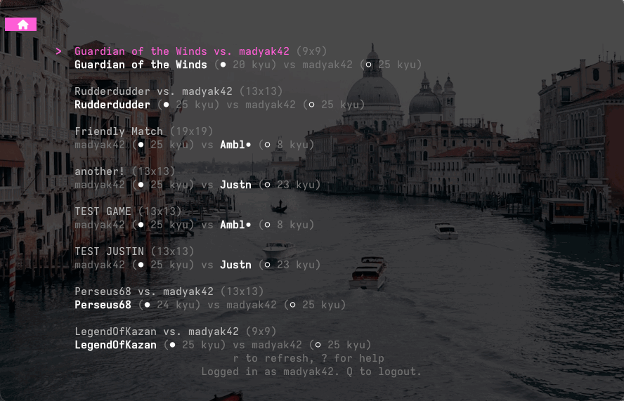

# gogo

Play Go in your terminal — local games and online play on [OGS](https://online-go.com).



## Installation

### Homebrew (macOS)

```sh
brew install tsraveling/tap/gogo
```

### Scoop (Windows)

```sh
scoop bucket add tsraveling https://github.com/tsraveling/scoop-bucket
scoop install gogo
```

### Debian / Ubuntu / Fedora / Alpine

Download the `.deb`, `.rpm`, or `.apk` from the [latest release](https://github.com/tsraveling/gogo/releases/latest) and install with your package manager, e.g.:

```sh
sudo dpkg -i gogo_*.deb
```

### Go

```sh
go install github.com/tsraveling/gogo@latest
```

### Manual

Download the archive for your platform from the [latest release](https://github.com/tsraveling/gogo/releases/latest), extract, and place `gogo` on your `PATH`.
